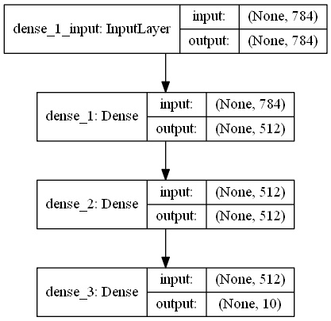

# Some quick understandable practice of tensorflow

***

## TensorFlow Intro

> [TensorFlow](https://tensorflow.google.cn/guide) ([github](https://github.com/tensorflow/tensorflow)) is an end-to-end open source platform for machine learning. It has a comprehensive, flexible ecosystem of tools, libraries and community resources that lets researchers push the state-of-the-art in ML and developers easily build and deploy ML powered applications.

Tensorflow architecture works in three parts:  

- Preprocessing the data
- Build the model
- Train and estimate the model

### Componnets of TensorFlow

What is tensor, can be found in following pdf.  

> Tensorflow's name is directly derived from its core framework: Tensor. In Tensorflow, all the computations involve tensors. A tensor is a vector or matrix of n-dimensions that represents all types of data. All values in a tensor hold identical data type with a known (or partially known) shape. The shape of the data is the dimensionality of the matrix or array.
>
> A tensor can be originated from the input data or the result of a computation. In TensorFlow, all the operations are conducted inside a graph. The graph is a set of computation that takes place successively. Each operation is called an op node and are connected to each other.
>
> The graph outlines the ops and connections between the nodes. However, it does not display the values. The edge of the nodes is the tensor, i.e., a way to populate the operation with data.

Graphs

> TensorFlow makes use of a graph framework. The graph gathers and describes all the series computations done during the training. The graph has lots of advantages:
>
> - It was done to run on multiple CPUs or GPUs and even mobile operating system
> - The portability of the graph allows to preserve the computations for immediate or later use. The graph can be saved to be executed in the future.
> - All the computations in the graph are done by connecting tensors together
>   - A tensor has a node and an edge. The node carries the mathematical operation and produces an endpoints outputs. The edges the edges explain the input/output relationships between nodes.

***

## Tensorflow with python

A large number of Tensorflow 2 python scripts require [Keras](https://keras.io/), a python ML library.

> 
> Keras is a high-level neural networks API, written in Python and capable of running on top of TensorFlow, CNTK, or Theano. It was developed with a focus on enabling fast experimentation. Being able to go from idea to result with the least possible delay is key to doing good research.
>
> Use Keras if you need a deep learning library that:
>
> - Allows for easy and fast prototyping (through user friendliness, modularity, and extensibility).
> - Supports both convolutional networks and recurrent networks, as well as combinations of the two.
> - Runs seamlessly on CPU and GPU.
>
> Read the documentation at Keras.io.  
> Keras is compatible with: Python 2.7-3.6.

***

## Cifar 10 examples

Three simple models using cifar10 dataset.

- cifar10_simple  
A simple CNN model, nothing special.
After 40 epochs training, accuracy is 80%.

- cifar10_resnet  
A resnet CNN model.  
After 40 epochs training, accuracy is 89%.

- cifar10_resnet_noshortcut  
A simple CNN model same as cifar10_resnet, but with no shortcut path.  
After 40 epochs training, accuracy is 82%.

***

## Quick start example

An example for simple calculation.

    # first, create a TensorFlow constant
    const = tf.constant(2.0, name="const")  # const(2)

    # create TensorFlow variables
    b = tf.Variable(2.0, name='b')  # b = 2
    c = tf.Variable(1.0, name='c')  # c = 1

    # now create some operations
    d = tf.add(b, c, name='d')  # d = b + c, 3
    e = tf.add(c, const, name='e')  # e = c + const(2), 3
    a = tf.multiply(d, e, name='a')  # a = d x e, 9

    print(a)

***

## Simple regression example

An example for solving regression problem.

### Model creation

    class Linear(tf.keras.Model):
        def __init__(self):
            super(Linear, self).__init__()
            self.W = tf.Variable(tf.random.uniform((2, 3)), name='weight')
            self.b = tf.Variable(tf.random.uniform((2, 1)), name='bias')
        def call(self, inputs):
            return tf.matmul(self.W, inputs) + self.b

### A toy dataset of points around W * x + b

    NUM_EXAMPLES = 2000
    training_inputs = tf.random.normal([3, NUM_EXAMPLES])
    noise = tf.random.normal([NUM_EXAMPLES])
    W = tf.Variable(np.array([1, 2, 3, 4, 5, 6]).reshape(2, 3).astype(np.float32))
    b = tf.Variable(np.array([7, 8]).reshape(2, 1).astype(np.float32))
    training_outputs = tf.matmul(W, training_inputs) + b + noise

### Loss function definition

    def loss(model, inputs, targets):
        error = model(inputs) - targets
        return tf.reduce_mean(tf.square(error))

### Gradient computation

    def grad(model, inputs, targets):
        with tf.GradientTape() as tape:
            loss_value = loss(model, inputs, targets)
        return tape.gradient(loss_value, [model.W, model.b])

### Model and Optimizer initilization

    model = Linear()
    optimizer = tf.optimizers.Adam(0.1)
    # optimizer = tf.keras.optimizers.SGD(learning_rate=0.1)
    print("Initial loss: {:.3f}".format(loss(model, training_inputs, training_outputs)))

### Training

    for i in range(300):
        grads = grad(model, training_inputs, training_outputs)
        optimizer.apply_gradients(zip(grads, [model.W, model.b]))
        if i % 20 == 0:
            print("Loss at step {:03d}: {:.3f}".format(i, loss(model, training_inputs, training_outputs)))

### Solution printing

    print(model.W, model.b)

***

## Regression solution example

It contains more format model deploying and training processes.

### Ground truth session

    # Parameters, ground-truth of W and b
    W_true = np.array([1, 2, 3, 4, 5, 6]).reshape(3, 2).astype(np.float32)
    b_true = np.array([7, 8, 9]).reshape(3, 1).astype(np.float32)

    # y = W * x + b
    def linear_forward(x, W=None, b=None, forward=False, W_true=W_true, b_true=b_true):
        # Fast forward for ground-truth
        if forward:
            return tf.matmul(tf.Variable(W_true), x) + tf.Variable(b_true)
        # Compute regression with input x and current W and b
        return tf.matmul(W, x) + b

    # Datas
    NUM_EXAMPLES = 2000
    x_data = np.random.normal(size=(2, NUM_EXAMPLES)).astype(np.float32)

    # Random fetch method
    def random_fetch(x_data=x_data, batchsize=10):
        # Shuffle on column dimension
        np.random.shuffle(np.transpose(x_data))
        # Cut data with batchsize
        x = x_data[:, :batchsize]
        # Generate noise
        noise = np.random.normal(size=(3, batchsize)).astype(np.float32)
        # Return x and y
        return x, linear_forward(x, forward=True) + noise

### Module building session

    # LinearModule building
    class LinearModel(tf.keras.Model):
        # Cross init
        def __init__(self):
            super(LinearModel, self).__init__()
            # Variables that are trainable
            self.W = tf.Variable(tf.random.uniform((3, 2)), name='weight')
            self.b = tf.Variable(tf.random.uniform((3, 1)), name='bias')
        # 'call method' of LinearModel
        def call(self, inputs):
            return linear_forward(inputs, self.W, self.b)

    # Computation of loss function to be optimized
    def loss(model, inputs, targets):
        error = model(inputs) - targets
        return tf.reduce_mean(tf.square(error))

    # Computation of gradient
    def grad(model, inputs, targets):
        with tf.GradientTape() as tape:
            loss_value = loss(model, inputs, targets)
        # Return current loss_value and gradient
        return loss_value, tape.gradient(loss_value, [model.W, model.b])

### Training session

    # Init LinearModuel as model
    model = LinearModel()
    # Init optimizer
    optimizer = tf.optimizers.Adam(0.1)
    # optimizer = tf.keras.optimizers.SGD(learning_rate=0.1)

    # Training 1000 times
    for i in range(1000):
        # Random fetch x and y
        x, y = random_fetch(batchsize=100)
        # Compute loss_value and grads
        loss_value, grads = grad(model, x, y)
        # Apply gradients
        optimizer.apply_gradients(zip(grads, [model.W, model.b]))
        # Print loss each 100 steps
        if i % 100 == 0:
            print("Loss at step {:03d}: {:.3f}".format(i, loss_value))

    # Print trained W and b
    print(model.W, model.b)

***

## MNIST simple model

Examples of how to `build` a simple three-layer network to discriminate digits in MNIST dataset, and how to `restore` and `use` it.

- [mnist_simple_model_training.py](mnist_simple_model_training.py]) shows how to train a model.
- [mnist_simple_model_using.py](mnist_simple_model_using.py) shows how to load and use it.
- [mnist_simple_model.h5](mnist_simple_model.h5) is the restored model.

 

### Training the model

    # %%
    import numpy as np
    import matplotlib.pyplot as plt
    import tensorflow as tf
    import keras
    from keras.datasets import mnist
    from keras.utils import np_utils
    import random
    from pprint import pprint

    # %%
    (X_train, y_train), (X_test, y_test) = mnist.load_data()
    print(X_train.shape, y_train.shape, X_test.shape, y_test.shape)

    nb_classes = 10

    def normalize(raw):
        return (raw.astype(np.float32) - 127) / 127

    dataset = dict(
        X_train = normalize(X_train.reshape(len(X_train), -1)),
        X_test = normalize(X_test.reshape(len(X_test), -1)),
        y_train = np_utils.to_categorical(y_train, nb_classes),
        y_test = np_utils.to_categorical(y_test, nb_classes),
    )
    pprint(dataset)

    # %%
    filepath = 'mnist_simple_model.h5'
    model = keras.models.load_model(filepath)

    # %%
    loss, accuracy = model.evaluate(dataset['X_test'], dataset['y_test'])
    print('Test loss:', loss)
    print('Accuracy:', accuracy)

    # %%
    plt.style.use('seaborn-dark')
    for i in range(9):
        plt.subplot(3,3,i+1)
        j = random.choice(range(len(dataset['X_test'])))
        x = dataset['X_test'][j]
        y = np.argmax(dataset['y_test'][j])
        cls = model.predict_classes(x[np.newaxis, :])
        plt.imshow(x.reshape(28, 28), cmap='gray', interpolation='none')
        plt.title("Guess {} of {}".format(cls[0], y))
    plt.tight_layout()

### Loading and using the model

    # %%
    import numpy as np
    import matplotlib.pyplot as plt
    import tensorflow as tf
    import keras
    from keras.datasets import mnist
    from keras.utils import np_utils
    import random
    from pprint import pprint

    # %%
    (X_train, y_train), (X_test, y_test) = mnist.load_data()
    print(X_train.shape, y_train.shape, X_test.shape, y_test.shape)

    nb_classes = 10

    def normalize(raw):
        return (raw.astype(np.float32) - 127) / 127

    dataset = dict(
        X_train = normalize(X_train.reshape(len(X_train), -1)),
        X_test = normalize(X_test.reshape(len(X_test), -1)),
        y_train = np_utils.to_categorical(y_train, nb_classes),
        y_test = np_utils.to_categorical(y_test, nb_classes),
    )
    pprint(dataset)

    # %%
    filepath = 'mnist_simple_model.h5'
    model = keras.models.load_model(filepath)

    # %%
    loss, accuracy = model.evaluate(dataset['X_test'], dataset['y_test'])
    print('Test loss:', loss)
    print('Accuracy:', accuracy)

    # %%
    plt.style.use('seaborn-dark')
    for i in range(9):
        plt.subplot(3,3,i+1)
        j = random.choice(range(len(dataset['X_test'])))
        x = dataset['X_test'][j]
        y = np.argmax(dataset['y_test'][j])
        cls = model.predict_classes(x[np.newaxis, :])
        plt.imshow(x.reshape(28, 28), cmap='gray', interpolation='none')
        plt.title("Guess {} of {}".format(cls[0], y))
    plt.tight_layout()

    # %%
    keras.utils.plot_model(model, show_shapes=True, to_file='mnist_simple_model.png')
